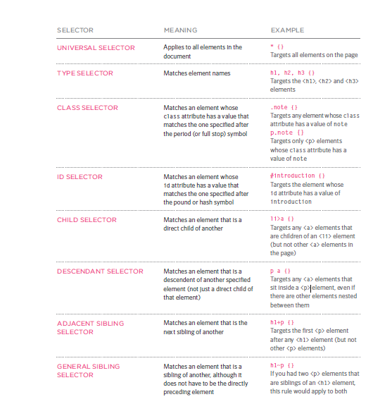

# CSS language 

CSS it abbreviation of (cascading style sheet) allows you to create rules that specify how the content of
an element should appear.

## how it work 
**external css**
CSS works by associating rules with HTML elements by ` <link> ` element can be used
in an HTML document to tell the browser where to find the CSS,and it lives inside the `<head>`

 `< link rel="stylesheet" href="style.css"/>`

 **internal css**
 You can also include CSS rules within an HTML page by placing them inside a `<style>` element,
which usually sits inside the`<head>` element of the page.
``` 
<head>
   <title>Using Internal CSS</title>
     <style type="text/css">
        body {
           font-family: arial;
           background-color: rgb(185,179,175);}
        h1 {
            color: rgb(255,255,255);}
    </style>
</head>

```


how it works 
you should select the element that you want to style it which is called `sellector`
then how it should be styled betwwen curly brckets which called `declaration`
``` 
p { 
    color:red;
    }
```





# color
You can specify any color in one of three ways:
- RGB values
- HEX code
- COLOR name


# functions
Functions let you group a series of statements together to perform aspecific task.
types of function
1. declaring function
```
function sayHello(){
   return document.write('hello'); 
}
sayHello();
```
2. expresstion function
```
var showImage = function() {
    code...code
}
showImage();
```